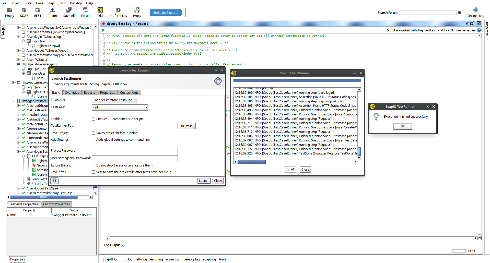

# Toolkit

**Q** PostMan, ReadyAPI of SoapUI?
**A** SoapUI; open source & geen registratie vereist.

Zelf ben ik bekend met [Katalon](https://katalon.com), maar heb dit vrij vlot uitgefaseerd vanwege:

- Vendor lock-in.
- Schier onwerkbaar i.c.m. source control.
- In het algemeen onoverzichtelijk.
- Omslachtig/high maintenance bij complexere/afwijkende test scenarios.
- Beperkte/afwezige un/re-do in editor.
- Editor kan (delen van) de test set om zeep helpen.
- Single purpose editor kennis & ervaring heeft weinig replay value.

# Werkwijze

**NB** AI is enkel gebruikt voor zoekopdrachten :)

- Importeer [SWAGGER definitie](https://petstore.swagger.io/v2/swagger.json). Gemak dient de mens.
- Selecteer 'Generate Test Suite'. Gemak dient de mens wederom.
- Als eerste adresseren: Authenticatie/Authorisatie. Nodig voor legitieme & succesvolle calls naar de API.
  - Hm, gedocumenteerde response matcht niet met werkelijke response...
  - `X-Rate-Limit`: calls per hour allowed by the user, mental note: challenge accepted.
  - `X-Expires-After`: minder spannend, niet minder test worthy.
  - Willekeurige usr/pwd combinaties lijken gewoon te worden geaccepteerd.
  - **Q** Waar kan ik response objecten definieren & valideren in SoapUI?
    **A** De request editor biedt mogelijkheden, maar niet op een re-usable manier.
  - Het maken van een login request met ontbrekende querystring parameters via point/click UI is niet straightforward of uberhaubt mogelijk via de request editor?
  - De twee bovenstaande headers zijn wel expliciet gedefinieerd in Swagger. Request assertions lijken geen optie voor response header validatie te bieden. Dan maar in script.
  - Uitgangspunt is om zoveel mogelijk gebruik te maken van specifieke editor opties, dat is wel even zoeken in SoapUI.
  - Het gebruik van eigen libraries lijkt helaas beperkt tot [ReadyAPI](https://www.soapui.org/docs/scripting-and-properties/scripting-and-the-script-library/); kan dubbele code niet vatten in een enkele klasse.
  - ...Op naar Grooxy om te kijken waar de grenzen liggen van het login endpoint

	En toen een vage foutmelding bij het openen van een/de request editor:

	```
	Thu Oct 02 15:10:05 CEST 2025:ERROR:An error occurred [Index 2 out of bounds for length 2], see error log for details
	```

	Een probleem met referenties naar querystring parameters in de definitie van een request. De SoapUI editor heeft bij de endpoint 2 parameters met dezelfde naam weten te plaatsen. Verwijderen middels de editor lijkt niet mogelijk.
	Moet de vrij uitgebreide project XML met de hand aanpassen om dit probleem te verhelpen; zonde van de tijd.

  - Ik heb mijn zinnen gezet op het uitvoeren van een login request zonder de vereist querystring parameters; een `low code` omgeving valt of staat met de mogelijkheden om de eigen beperkingen met code te omzeilen.
  - Het ziet er na veel `trial & error` en lezen van de documentatie naar uit dat het niet anders kan dan of handmatig een uniek endpoint definieren (naming hell: loginUser, loginUserPwd, ...) of een volledige Groovy implementatie te bouwen. Dit resulteert hoe dan ook in flink wat dubbele code & toename in maintenance burden.
  - Hopelijk zit ik er finaal naast met deze bevindingen...
  - Verder met het toevoegen van leuke test cases: X-Rate-Limit.. Wat doet de server by 5k+ calls? De SoapUI crasht/unresponsive bij een 2e test case run. Bij een derde run word de reden duidelijk; onverwachte threading, het Groovy script is klaar, maar requests lopen wel degelijk nog. Kan daardoor niet bepalen of er wel 5k request in 1 uur worden uitgevoerd.
  - Eens kijken naar security tests, daar word bij de configuratie van een test de optie 'username2' aangeboden als querystring parameter, waar komt die vandaan? Er zit blijkbaar in het login request in de definitie van de REST def. import die daar niet in voor komt.
  - SQL insertion & Invalid type scan toegevoegd. Jammer dat assertions telkens opnieuw samengesteld moeten worden.
  - Bij het grasduinen door de requests die gecreeerd zijn obv de Swagger definitie JSON, word duidelijk dat er toch het e.e.a. niet volledig is overgenomen: de `/user/createWithList` functie heeft niet de juiste input definitie, die wel voorkomt in de JSON. Bij de functie `user/createUser` is dat wel gelukt.
  - Eens een loadtest proberen. Het lijkt er op dat ik alleen alle teststeps in een testcase can loadbalancen. Dat lijkt niet heel zinvol; voor sommige steps is de response tijd irrelevant. Om dat te realiseren moet kan ik wel assertions per step instellen, maar niet slechts 1 enkele uitsluiten. Omslachtig.
  - Hoe representatief is een loadtest vanaf 1 enkel device?
  - Load test wil niet meer initialiseren en draaien, blijft hangen op starten van threads/virtual user initialisatie. Maar even uit/inloggen (want Linux)
  - SoapUI start in zijn geheel niet meer op... Hot Reboot dan maar; onveranderd, SoapUI start niet op.
  - Cold Reboot. Dito. Ik denk dat de goden willen duidelijk maken dat het genoeg is geweest...

# Test Resultaat


